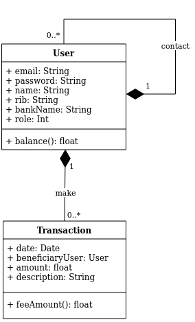
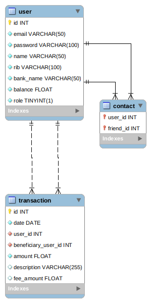

# Pay My Buddy

Pay my buddy is an application to easily send money to your friend.

## Diagrams

### UML Class Diagram



### Physical Data Domain



## Installation

This application was developed with __Java OpenJDK 11.0.15__ and __Maven 3.8__

You can compile the application in your prompt from the project folder : 

```shell
mvn clean install
```
__Before compile please be sure to use the right database connection information in properties file `./src/main/resources/application.properties`__

The jar file is generated in the folder _target_ at the root of project.

It recommended copying it in a working folder and renamed it to _patmybuddy.jar_.

Before use the application, you need to install a [MySQL 8.0 server](https://dev.mysql.com/doc/mysql-installation-excerpt/8.0/en/)

You can also use Docker to run it. 

See docker-compose.yml example :

```yaml
version: '3.8'

services:

  db:
    image: mysql:8.0.28
    container_name: paymybuddy_db
    environment:
      MYSQL_ROOT_PASSWORD: rootroot
      MYSQL_DATABASE: paymybuddy
      MYSQL_USER: USERNAME
      MYSQL_PASSWORD: STRONGPASSWORD
    ports:
      - 3306:3306
    volumes:
      - dbdata:/var/lib/mysql

volumes:
  dbdata:
```

### SQL scripts

__MySQL 8__ server have been used to develop this application.

To create the database copy this code, except if using __Docker__

```mysql
CREATE DATABASE IF NOT EXISTS paymybuddy CHARACTER SET utf8mb4 COLLATE utf8mb4_general_cli;
```

To allow a user to use the database copy this code, except if using __Docker__. It's highly recommended to a production environment.

```mysql
CREATE USER 'USERNAME'@'localhost' IDENTIFIED BY 'STRONGPASSWORD';
GRANT ALL PRIVILEGES ON paymybuddy.* TO 'USERNAME'@'localhost';
FLUSH PRIVILEGES ;
```

_You must change __USERNAME__ and __STRONGPASSWORD__ with your own information._

Now you can create and populate (if you want test this POC) tables with this code or execute the [following files](./docs/script.sql) on your MySQL server.

```mysql
USE paymybuddy;

CREATE TABLE `user`
(
    `id`        int          NOT NULL AUTO_INCREMENT,
    `email`     varchar(50)  NOT NULL,
    `password`  varchar(100) NOT NULL,
    `name`      varchar(50)  NOT NULL,
    `rib`       varchar(100) NOT NULL,
    `bank_name` varchar(50)  NOT NULL,
    `balance`   float        NOT NULL,
    `role`      boolean      NOT NULL DEFAULT '0',
    PRIMARY KEY (`id`),
    UNIQUE KEY `email` (`email`)
);

CREATE TABLE `contact`
(
    `user_id`   int NOT NULL,
    `friend_id` int NOT NULL,
    PRIMARY KEY (`user_id`, `friend_id`),
    KEY `userid` (`user_id`),
    KEY `friendid` (`friend_id`),
    CONSTRAINT `friendid` FOREIGN KEY (`friend_id`) REFERENCES `user` (`id`),
    CONSTRAINT `userid` FOREIGN KEY (`user_id`) REFERENCES `user` (`id`)
);

CREATE TABLE `transaction`
(
    `id`                  int   NOT NULL AUTO_INCREMENT,
    `date`                date  NOT NULL,
    `user_id`             int   NOT NULL,
    `beneficiary_user_id` int   NOT NULL,
    `amount`              float NOT NULL,
    `description`         varchar(255) DEFAULT NULL,
    `fee_amount`          float        DEFAULT NULL,
    PRIMARY KEY (`id`),
    KEY `user_id` (`user_id`),
    KEY `beneficiary_user_id` (`beneficiary_user_id`),
    CONSTRAINT `transaction_ibfk_1` FOREIGN KEY (`user_id`) REFERENCES `user` (`id`) ON DELETE CASCADE,
    CONSTRAINT `transaction_ibfk_2` FOREIGN KEY (`beneficiary_user_id`) REFERENCES `user` (`id`) ON DELETE CASCADE
);
```

```mysql
INSERT INTO `user` (`email`, `password`, `name`, `rib`, `bank_name`, `balance`, `role`)
VALUES ('jerome@mail.fr', '$2y$10$z8ycLx9471w0mfC0nMhYN.gcp3cVK3JsQdbgAyvgx8WmcuA3kEsz2', 'Jerome',
        'FR700932922111114444', 'banque A', '0.0', '1'),
       ('hayley@mail.fr', '$2y$10$z8ycLx9471w0mfC0nMhYN.gcp3cVK3JsQdbgAyvgx8WmcuA3kEsz2', 'Hayley',
        'FR702134456787663332', 'banque B', '0.0', '0'),
       ('clara@mail.fr', '$2y$10$z8ycLx9471w0mfC0nMhYN.gcp3cVK3JsQdbgAyvgx8WmcuA3kEsz2', 'Clara',
        'FR706545033373569645', 'banque A', '0.0', '0'),
       ('smith@mail.fr', '$2y$10$z8ycLx9471w0mfC0nMhYN.gcp3cVK3JsQdbgAyvgx8WmcuA3kEsz2', 'Smith', 'FR70765498230992134',
        'banque B', '0.0', '0');
```

For all users, the password is ___password123___.

The user ___"jerome@mail.fr"___ is an administrator.

__Please drop table before use them in production environment !__

## Usage

Before launch the application, ensure you the database is running.

If you use __Docker__, build your MySQL server with : 

```shell
docker-compose up -d
```

After, you can use this command to stop or start your database : 

```shell
docker-compose stop
docker-compose start
```

To run application use the following command :

```shell
java -jar paymybuddy.jar
```

Now you can access to the application with your favorite browser at this address :

__http://localhost:8080__

Finally, create a new user or connect with an existing user directly add to the database.